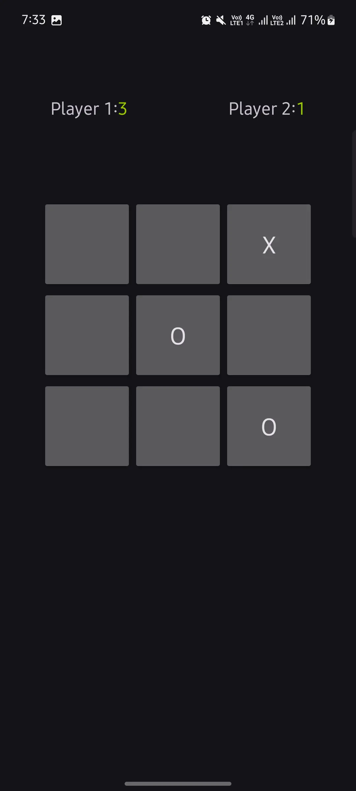

# Tic Tac Toe (Zero Cross)

Tic Tac Toe (Zero Cross) is a classic game where two players take turns marking spaces in a 3x3 grid, aiming to get three of their symbols in a row, column, or diagonal. This application uses 2D dimensional array to calculate the condition for win condition and check for draw condition.

## Features

- **Two Players**: Play against a friend on the same device.
- **Win Condition Check**: The game checks for win conditions after each move to determine if a player has won.
- **Draw Condition Check**: If all spaces are filled without a winner, the game declares a draw.
- **Simple User Interface**: Clean and intuitive interface for a seamless gaming experience.

## How to Play

1. Launch the game on your device.
2. The game starts with Player 1 (X) making the first move.
3. Players take turns tapping on an empty space in the grid to place their symbol (X or O).
4. The game continues until one player achieves three of their symbols in a row, column, or diagonal, or until the board is full.
5. If a player wins, a message will be displayed indicating the winner.
6. If the game ends in a draw, a draw message will be displayed.

## Screenshots

## Technologies Used

- **Android Studio**: The game is developed using Android Studio, utilizing Kotlin programming language.
- **XML**: Layouts are designed using XML for the user interface.

## Installation

To play the game, simply download the APK file from the provided link and install it on your Android device.

## Contributions

Contributions to the project are welcome! If you'd like to contribute new features, bug fixes, or improvements, please feel free to submit a pull request.

## License

This project is licensed under the [MIT License](LICENSE).

